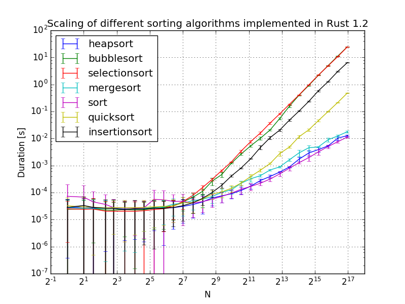

Sorting algorithms implementations in Rust (1.2).

# Goal

The goal of this project is purely educational and contains two aspects.

First is to learn different canonical sorting algorithms and their implementations.
Starting on Wikipedia's
[sorting algorithms page](https://en.wikipedia.org/wiki/Sorting_algorithm)
I read the summary of some of the algorithms described here and tried to implement them without
looking at the details. I did not research any optimization on them and as such, there might be
faster (but more complicated) ways of implementing them. I did put some though in the
implementations as to have efficient and clean implementations without wasting memory.

My second goal is to learn Rust, a new language which I find quite promising. Created at
Mozilla and developed in the open by a wonderful community, Rust has an initial goal of
creating a language to replace C++ as the language of choice for Firefox's rendering engine.

Some of the goals of Rust are:

* Memory safety without garbage collection
* Concurrency without data races
* Abstraction without overhead
* Stability without stagnation

For more information on Rust, see:

* Rust homepage: https://www.rust-lang.org/
* Wikipedia: https://en.wikipedia.org/wiki/Rust_%28programming_language%29

The code should be well commented and simple to follow and/or expand. Unit tests are used to
validate every implementations.

This module is greatly inspired by my C++ templated sorting library located here:
https://github.com/nbigaouette/sorting.

# Algorithms

Sorting functions are encapsulated into modules. Implemented algorithms are:

## Simple sorts

* [Insertion sort](https://en.wikipedia.org/wiki/Insertion_sort)
* [Selection sort](https://en.wikipedia.org/wiki/Selection_sort)

## Efficient sorts

* [Quicksort](https://en.wikipedia.org/wiki/Quicksort)
* [Merge sort](https://en.wikipedia.org/wiki/Merge_sort)


# Usage


# Notes

API documentation can be found on GitHub pages at http://nbigaouette.github.io/rust-sorting/.

# Testing and validation


# Benchmarks

The library uses Rust's FFI to export the sorting functions. A Python 3 module is provided `rust_sorting.py` that loads the library and exposes the different functions. The script `benchmark.py` will run the algorithms with arrays of random data multiple times and plot the timing calculations.

To reproduce:

```ignore
cargo build --release
python3 benchmark.py
```

To reload data and replot (no need for previous run):

```ignore
python3 benchmark.py --reload
```



# License
This code is distributed under the terms of the BSD 3-clause "New" or "Revised" License and is Copyright 2015 Nicolas Bigaouette.
